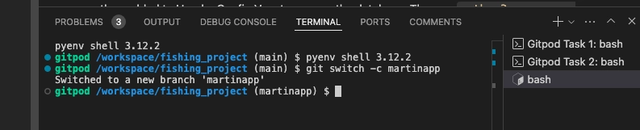

# Fished it, Mate!

<br>
<br>
Fished it, Mate! Is meant to be a blog site for fishing. The user can create read update and delete [in line with CRUD functionality] a post, and also comments on other blogs posts. The desire was to make a more interactive type blog that users can add a 'Location', 'Type of fish caught', and 'Fishing method used', to give more specific and user orientated experience. Such as : "martin's fisheries - martinchester', 'Carp', 'Pole and float'. Extra features for the future could include more details such as a pond or depth, or even weather/season. this type of website could be good for users keeping a diary or log of fishing activity but with the added functionality of searching for information pertinent to their criteria. This could be purely for interest or for looking for new venues/places to fish based the expereince of like minded people.
<br>
<br>
<hr>

 <!-- Google Fonts CSS -->
<link rel="preconnect" href="https://fonts.gstatic.com">    
<link href="https://fonts.googleapis.com/css2?family=Delius+Swash+Caps&family=Red+Hat+Display:ital,wght@0,300..900;1,300..900&display=swap" rel="stylesheet">

<style>
h2 {
    color: #fcc58e;
    font-family: "Red Hat Display", serif;
    font-size: 20px;
}

/* Style the button */
.top-link {
  transition:       all .25s ease-in-out;
  position:         fixed;
  bottom:           0;
  right:            0;
  display:          inline-flex;
  color:            #000000;

  cursor:           pointer;
  align-items:      center;
  justify-content:  center;
  margin:           0 2em 2em 0;
  border-radius:    25%;
  padding:          .25em;
  width:            2em;
  height:           2em;
  background-color: #fcc58e;
}
</style>

<p align="center">
  <a href="https://github.com/MartinCowey">
    
  </a>

  <h2 class="port" align="center">Developer: Martin Cowey</h2>
  <br>
  

  <p align="center">
    See the website
    <br />
    <a href="https://fished-it-mate-c5653a6c521b.herokuapp.com/"><strong>View Deployed site »</strong></a>
    <br />
  </p>
</p>


<br>
<hr>

# Contents

<details>
<summary>
Table of Contents ::
</summary>

- [Design](#design)
  - [Colour Scheme](#colour-scheme)
  - [Fonts](#fonts)
  - [Wireframes](#wireframes)
    - [Desktop](#desktop)
    - [Mobile)](#mobile)

- [Models](#models-)
  - [Database Schema](#database-schema)
  - [All Auth](#allauth-user-model)
  - [Blog](#blog-model)
  - [Comments](#comment-model)
  - [Custom](#custom-model)
    - [Profile custom 1](#profile-model---custom-1)
    - [Location custom 2](#location-model---custom-2)
<br>
</details>
<br>
<br>
<hr>

## Design


### Colour Scheme


### Fonts

The font used in this project 

<br>

<br>
I chose 2 fonts for the contrast. The first and main being Red Hat, which will be used for most of the project.


### Wireframes

#### Desktop

<details><summary>Home</summary>

</details>

#### Mobile

<details><summary>Home</summary>

</details>

<hr>

## Models :

### Database Schema


### Allauth User Model

The User model is an integral component of Django Allauth, featuring pre-established fields as part of its standard configuration. Among these fields are username, email, name, password, and others. This model primarily serves the purpose of user authentication, which is why it is not recommended to make direct alterations to it. Furthermore, the User model is linked to the Profile model through a one-to-one relationship, facilitating the management of user-specific data and interactions.


### Blog Model

The Blog Model is the basis of providing valuable information for the user to act like a diary or log, but also being viewable to other users create a source of  information for new venues or fishing experiences to take on board and try.

### Comment Model

The Comment Model gives the user the opportunity to get involved with other users posts - making it more interactive and community based. The ability to make a log for your own expereince is great but being able to share exepriences and contribute to other peoples fishing experience is a valuable piece of the website.

### custom model

#### Profile Model - custom //1

The Profile Model in this MVP is designed as a simple user datapoint for further scope. Here we use the profile model for a more extanded use than the allauth features of Django. This way the user has a specified base on which to move around the site for the blog model and comment model - but will be ready for future scope such as the location model and searchable content.

#### Location Model - custom //2

This is outside the scope of the MVP but is integral to the search capabilites of the site - creating look up charts to store relevant information such as Location, Fishing type and different fish - this is would contribute to the nature of the site being about logging data relevant to the fishing experience that can be searchable at a later date or by others.

## Future Features

Future features are beyond the initial scope of this project but are important to discuss. They help to give context to the project and a direction. The mvp for this is basic but gives enough continuity for the user to engage with the experience.

### Search Feature

This is an immediate future feature and should be implimented in the second phase. The ability to search is a must and makes the experience even more engaging. This feature simply allows for the main idea of 'Location' - 'Type of Fish' - 'Fishing methods' to be organised an used in a way that allows user choice of the information they see.

### Search Feature 2

After the search features for 'Location' - 'Type of Fish' - 'Fishing methods' are implimented then more can be added for a finer more intuitive experience. Things such as 'Fishing method' can be broken down into further sub menues like float or type of float. We cana also look at 'depth', or 'season', 'time of day', 'time of year' or even 'weather conditions' to add more exciting interactivity to the site.

### Password Reset with Email Validation

Introduce a secure and user-friendly password reset system that relies on email validation, making it easier for users to regain access to their accounts.

### Messaging System/Ticket System

- Develop a messaging system that enables users to send direct messages to each other, fostering user interaction.
- Alternatively, create a ticket system where users can contact the developer for technical issues or support, providing a more organized and responsive channel for communication. This is especially important because the current contact method is limited to an email in the footer, which may not be as user-friendly.

### Sharing

Add a share button to articles, allowing users to effortlessly share content on their social media platforms, increasing the website's visibility and user engagement.

### Favourites

Add a favourites button to articles, allowing users to effortlessly share content on their social media platforms, increasing the website's visibility and user engagement.


## Deployment

After the initial startproct was created I went on to adding my apps - the first app beig the blog. This was created with the `python3 manage.py startapp blog` command, producing the relevant folder structure from Django with it's own `models.py` and `views.py` files. Then we register the app so Django can include it in our project via the `settings.py` `INSTALLED_APP`S as `'blog',`. Apps add specific functionality to the project.

Page loaded for the project 
<br>

<br>

To test the app we can create a HttpResponse in the views.py using from django.http import HttpResponse and a function that will show on the site as a 'response' to the appended /blog

<br>

<br>

### Heroku

Set up for Heroku and gunicorn so we can serve the Django webiste - the cloud server hosts the database and Django project. A cloud-based Platform as a Service (PaaS) that allows us to deploy, manage, and scale applications without the need to manage any infrastructure, such as servers.
In Heroku we chcreate a new app with a unique name and select the region. After this we need to set the Config Vars with a new key for `DISABLE_COLLECTSTATIC` with a *value of 1*, and then connect to the github repo for this project. Back in Github we need to update the code for deployment using the gunicorn command and freeze to the requirements: `pip3 install gunicorn~=20.1` and `pip3 freeze --local > requirements.txt`.
<br>

<br>
Next create a Procfile in the root directory [capital P] and the only thing needed in this file is `web: gunicorn fishing_main.wsgi`. This is a text file used by Heroku to determine how to run the application. For my Django project, the Procfile typically specifies how to start the web server using Gunicorn, a popular WSGI HTTP server for Python applications. Gunicorn [also known as Green Unicorn] is recommended for serving Django applications in production environments - "a bridge between your Django app and the web".

In `settings.py` set `Debug = False` for the Heroku deployment - this protects the website from showing important information especially during bugs or errors.

Moving forward I changed to the code: DEBUG = 'DEBUG' in os.environ and added the conncetion in the env.py file so Herkou sees as False and local will see as True.

Also used the `python3 manage.py collectstatic` and made sure to remove the `DISABLE_COLLECTSTATIC` from Heroku.

Bug in deployment:
<br>

<br>

### Database 

After using the Database maker to get the PostgreSQL database URL, we need to `pip3 install dj-database-url~=0.5 psycopg` then freeze this to `requirements.txt`. I had already created a `env.py` file in the *root directory* and was already add to the gitignore using the ci template. From there we import the os and add the `DATABASE_URL` and `SECRET_KEY` so these are hidden. These are then added to Heroku Config Vars to engage the database. Then we `python3 manage.py migrate`, and create the superuser.

After these steps the previous bug had been solved:

It meant the preview for the Heroku deployed site wasn't connected to the database or secret key, and once this was added into Config Vars the /blog append worked:

<br>

<br>
Now Succesfully deployed:
<br>

<br>


<br>
<hr>

## Errors and Bugs

An error which I need reminding about...`Debug=True`. This has got me a few times, especially with the styling aspects, and always after I git push notice I didn't set back to False.
<br>

<br>

Not so much an error and more a precaution *or better workflow* decided to use a branch moving into the build stages to keep flow and then merge to main with changes that work.
Created a barnch : `git switch -c branchname`, then `git push --set-upstream origin martinapp` for the first push so REMOTE knows it exists.

Then for merging use: switch to the main - `git checkout main`, pull the changes from the REMOTE main branch - `git pull`. Switch back to the local `git checkout martinapp`, merge this local branch into the local new branch `git merge main`. Resolve any conflicts then *git add and commit* and finally push. Then being my own repo I need do the pull requests.

<br>

<br>


## Apps and Models

### Blog

The first model to be applied was the blog model. This was populated in the class Blog and migrated succesfully - this migrated succesfully and fits in with the ERD:

<br>

<br>
<br>

<details>
<summary>Blog model code</summary>
<br>
Based on my ERD fields I populated the blog modle with:

```author = models.ForeignKey(User, on_delete=models.CASCADE)
    title = models.CharField(max_length=200)
    slug = models.SlugField(unique=True)
    content = models.TextField()
    excerpt = models.TextField()
    created_on = models.DateTimeField(auto_now_add=True)
    featured_image = CloudinaryField('image')
```

</details>

### Admin

Admin successfully brought through with Django :

```
from .models import Blog

# Register your models here.
admin.site.register(Blog)
```

Adding the blog/admin.py file registers the Blog model with Django's admin site. Taking the Blog model from our models'py file and then registers the Blog model with the Django admin site which automatically creates an admin interface for it adding an element of CRUD to this admin page for blog posts via the admin panel. A quick way to manage blogs posts for the superuser at this stage.
The line from .models import Post imports the Post model from the current application's models.py file.

<br>

<br>
<br>

## Procedure

### Git branch

The prupsoe of making a new branch from the main in this instance [being my individual project] was to help create a more non-destructive workflow. Adopting a similar strategy from my days working in design and photography and using such things as Photoshop or Illustrator. The premise being that I work on a branch during changes, then push to the main branch once I have worked on bugs and errors. I believe this would be a more professional process too.

<details>
<summary>Git merge process</summary>
Process:

branch/local ::
`git add . && git commit -m "Add *****"`
`git push` #Push your changes to the remote repository
>>having previous used the command `git push --set-upstream origin branch_name` then `git push` is ok at this stage - however [if not] then the correct use here would be `git push origin branch_name`

git checkout main

main ::
`git pull` #pull the latest changes from REMOTE main branch
`git checkout branch_name`

branch/local ::
`git merge main`
resolve any conflicts here - may need to save/close the MERGE_MSG here [see below]
if any updaes needed to be resolved `git add . && git commit -m "Changes"`

FINAL ::
`git push`
<br>
</details>

<br>


<details>
<summary>Merge issue</summary>

One bug I encountered that turned out to be more user error - due to relearning the branch/main merge - was with the process outlined above. When encountering the process I thought I was getting a bug with the MERGE_MSG but this turns out to be part of the process:

<br>

<br>

Also I didn't make pull requests in github as I believed that github automatically did this - which had a knock on effect for pulling from my branch and the main wasn't aligned with my new branch.


<br>
</details>


## Defensive Design

CSRF : Cross-Site Request Forgery


## Future Features


# Testing


[BACK TO TOP](#contents)

<br>
<a class="top-link hide" href="#top">↑</a>
<a name="top"></a>


