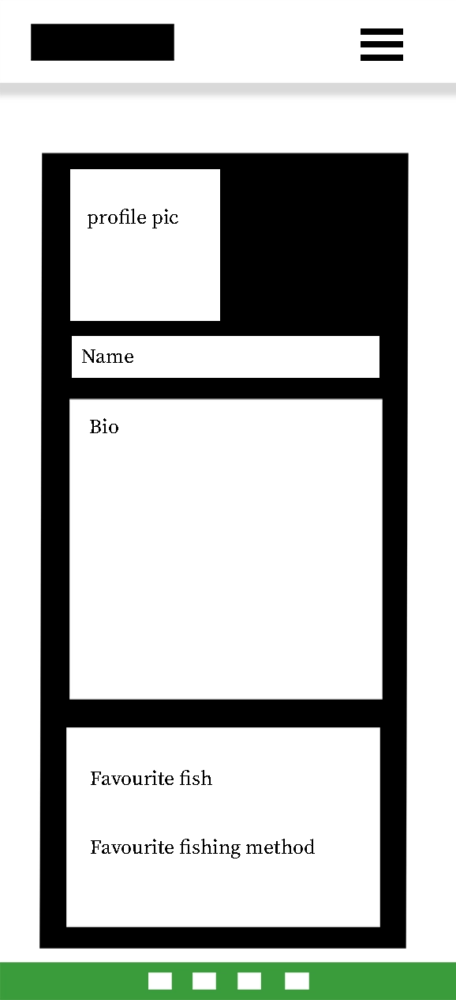
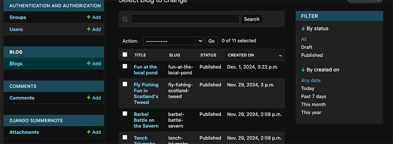

# Fished it, Mate!

<br>
<br>
Fished it, Mate! Is meant to be a blog site for fishing. The user can create read update and delete [in line with CRUD functionality] a post, and also comments on other blogs posts. The desire was to make a more interactive type blog that users can add a 'Location', 'Type of fish caught', and 'Fishing method used', to give more specific and user orientated experience. Such as : "martin's fisheries - martinchester', 'Carp', 'Pole and float'. Extra features for the future could include more details such as a pond or depth, or even weather/season. this type of website could be good for users keeping a diary or log of fishing activity but with the added functionality of searching for information pertinent to their criteria. This could be purely for interest or for looking for new venues/places to fish based the expereince of like minded people.
<br>
<br>
<hr>

 
<hr>

<p align="center">
  <a href="https://github.com/MartinCowey">
  
  </a>

  <h2 class="port" align="center">Developer: Martin Cowey</h2>
  <br>
  

  <p align="center">
    See the website
    <br />
    <a href="https://fished-it-mate-c5653a6c521b.herokuapp.com/"><strong>View Deployed site »</strong></a>
    <br />
  </p>
</p>

<br>

 <p align="center">
    Super User
    <br />
    <a href="https://fished-it-mate-c5653a6c521b.herokuapp.com/admin/login/?next=/admin/"><strong>Admin login »</strong></a>
    <br />
  </p>
</p>


<br>
<hr>

<br>
<br>
<hr>

# Table of Contents

<details>
<summary>Click to expand</summary>

- [Fished it, Mate!](#fished-it-mate)
- [Design](#design)
  - [Colour Scheme](#colour-scheme)
  - [Fonts](#fonts)
- [Project Planning](#project-planning)
  - [Site Goals](#site-goals)
- [UX](#ux)
  - [Strategy Plane](#strategy-plane)
  - [Scope Plane](#scope-plane)
  - [Structure Plane](#structure-plane)
  - [Skeleton Plane](#skeleton-plane)
  - [Surface Plane](#surface-plane)
- [Agile Methodologies - Project Management](#agile-methodologies---project-management)
  - [MoSCoW Prioritisation](#moscow-prioritisation)
  - [User Stories](#user-stories)
  - [Wireframes](#wireframes)
    - [Desktop](#desktop)
    - [Tablet](#tablet)
    - [Mobile](#mobile)
- [Models](#models)
  - [Database Schema](#database-schema)
  - [Allauth User Model](#allauth-user-model)
  - [Blog Model](#blog-model)
  - [Comment Model](#comment-model)
  - [Custom Models](#custom-models)
    - [Profile Model](#profile-model---custom-1)
    - [Location Model](#location-model---custom-2)
- [Future Features](#future-features)
  - [Search Feature](#search-feature)
  - [Search Feature 2](#search-feature-2)
  - [Password Reset with Email Validation](#password-reset-with-email-validation)
  - [Messaging System/Ticket System](#messaging-systemticket-system)
  - [Sharing](#sharing)
  - [Favourites](#favourites)
- [Deployment](#deployment)
  - [Heroku](#heroku)
  - [Database](#database)
- [Apps and Models](#apps-and-models)
  - [Blog](#blog)
  - [Admin](#admin)
- [Procedure](#procedure)
  - [Git Branch](#git-branch)
- [Defensive Design](#defensive-design)
  - [Languages Used](#languages-used)
  - [Libraries and Frameworks](#libraries-and-frameworks)
  - [Python Modules Imported](#python-modules-imported)
- [Features](#features)
- [User View - Registered/Unregistered](#user-view---registeredunregistered)
- [CRUD Functionality](#crud-functionality)
- [Testing](#testing)
  - [TESTING.md](TESTING.md)
- [Acknowledgements](#acknowledgements)
- [Resources](#resources)


</details>


## Design


### Colour Scheme

The colour scheme is relatively simple for this: Looking at greens for nature and fishing. A nice deeper earthy green that gives a sense of calm. Also a simple white background to keep this clean and less cluttered, to give ease of viewing for the content.


Webste - text and background


Logo


### Fonts

The font used in this project 


I chose 2 fonts for the contrast. The first and main being Red Hat, which will be used for most of the project.

in terms of font colour : my main colour against white background would be the 

however to maximise again the slamon colour background for messages I needed to darken the green to: 182518


as the normal font colour wasn't passing the contrast checker:


 

<hr>
<p align="right"><a href="#fished-it-mate">Back To Top</a></p>

# Project Planning  
 

### Site Goals

- Create an environment where people can create, read, update and delete a profile [created by themselves] : *custom app 1*
- Create acommunity so people can create, read, update and delete their own blog posts in order to log a sessions fishing : *custom app 2*
- Intuitive and inclusive User Interface, and desing strategy for CRUD functionalities.
- A UX applied website with a good solid responsive application remaining the same across mobile, tablet or desktop
- Future features ready for growing and meeting client/user needs.
- Current blogs have ai generated content, and also original User generated content for testing and viewing

## UX

The UX development for this Django blog project has been structured using the 5 planes of UX design, which hopefully provide a comprehensive framework for creating the user-centered experience. Here's a summary of how these planes applied to my project:

-Strategy Plane

The foundation of my blog's UX design lies in the strategy. For this Django blog, the primary goals are:
- Allow users to create and manage their profiles
- Enable users to create, read, update, and delete blog posts
- Provide an easy-to-navigate, responsive design
- User needs include easy account creation, profile customisation, blog post management, and seamless site navigation

-Scope Plane

The scope of my Django blog includes the following key features:
- User authentication (registration, login, logout)
- Profile CRUD functionality
- Blog post CRUD functionality
- Image upload for blog posts
- Commenting system
- Responsive design for various devices
These features align with the user stories developed, ensuring that the project meets both user needs and business objectives.

-Structure Plane

The structure of my blog will focus on organising content and functionality logically. Creating an information architecture that includes:
- Home page with featured or recent blog posts
- User dashboard for managing profile and posts
- Individual blog post pages
- Profile pages
- Navigation menu for easy access to key features
This structure supports intuitive user flows, such as from creating a post to commenting or from viewing a profile to reading that user's blog posts.

-Skeleton Plane

My wireframes should outline:
- Layout of each page type (home, blog post, profile, etc.)
- Placement of navigation elements
- Location of key features like login/logout buttons
- Content areas for blog posts and comments
These wireframes - [Wireframes](#wireframes) show the interface design, with a base for where all elements are positioned to support user tasks efficiently.

-Surface Plane

For the final visual design: *After the site was finished*
- Develop a consistent colour scheme and typography that aligns with the blog's purpose
- Create visually appealing buttons and interactive elements, with user feedback
- Ensure readability of blog posts on various screen sizes
- Implement responsive design techniques for seamless mobile experience
- Use appropriate whitespace to enhance content legibility and overall aesthetics
I tried to apply the visual design consistently across all pages to maintain a cohesive user experience

## Agile Methodologies - Project Management

 I followed the Agile planning methodolgy for this project and used a kanban project board building my user stories: [Github Projects Board](https://github.com/users/MartinCowey/projects/5/views/1) to plan the process effectively. Meeting specific goals for each app meant I could move onto a lot more parts in the project beyond my MVP.

 Project board showing Agile workflow:

 

<br>

 Implimenting User and Owner stoies:

  

<br>

### MoSCoW Prioritisation

For this project i used the MoSCoW Prioritisation method to help manage the tasks:

- **Must Haves**: this was the required MVP for the project with my first custom app being the Custom Profile. 
- **Should Haves**: these began to add more functionality to the user experience and widen the scope further.
- **Could Haves**: again further scope to add more interactivity and user experience beyond me initial MVP, some of which did manage to get done
- **Won't Haves**: these weren't adopted in my project as I wanted to give myself a more rounded scope for elements that had a possible range for the scope

### User Stories


| ID | User Story | MoSCoW |
|:-:|:-|:-:|
| [#1](https://github.com/MartinCowey/fishing_project/issues/1) | As a _User_, I can _register an account_ so that _I can engage with full site functionality_. | Must  |
| [#2](https://github.com/MartinCowey/fishing_project/issues/2) | As a _User_, I can _manage my account settings_ so that _I can update my details and preferences_. | Must |
| [#3](https://github.com/MartinCowey/fishing_project/issues/3) | As a _User_, I can _add my fishing location_ so that _I can track where my fishing activities took place_. | Could |
| [#4](https://github.com/MartinCowey/fishing_project/issues/4) | As a _User_, I can _add the type of fish I have caught_ so that _I can log my fishing experiences_. | Could |
| [#5](https://github.com/MartinCowey/fishing_project/issues/5) | As a _User_, I can _add the type of fishing method used_ so that _I can record details about my techniques_. | Could |
| [#6](https://github.com/MartinCowey/fishing_project/issues/6) | As a _User_, I can _open a blog post_ so that _I can read detailed content shared on the platform_. | Must |
| [#7](https://github.com/MartinCowey/fishing_project/issues/7) | As a _User_, I can _manage my blog posts_ so that _I can create, update, and delete my posts_. | Must |
| [#8](https://github.com/MartinCowey/fishing_project/issues/8) | As a _User_, I can _comment on a blog post_ so that _I can engage with other users' posts_. | Must |
| [#9](https://github.com/MartinCowey/fishing_project/issues/9) | As a _User_, I can _modify or delete my comment on a blog post_ so that _I have control over my contributions_. | Must |
| [#10](https://github.com/MartinCowey/fishing_project/issues/10) | As a _User_, I can _create blog drafts_ so that _I can save my work before publishing it_. | Could |
| [#11](https://github.com/MartinCowey/fishing_project/issues/11) | As a _Site Owner_, I can _approve comments on blog posts_ so that _only appropriate comments are displayed_. | Must |
| [#12](https://github.com/MartinCowey/fishing_project/issues/12) | As a _User_, I can _read blog posts_ so that _I can engage with relevant content shared by others_. | Must |
| [#13](https://github.com/MartinCowey/fishing_project/issues/13) | As a _User_, I can _manage my PROFILE account settings_ so that _I can update my details and preferences_. | Must |
| [#14](https://github.com/MartinCowey/fishing_project/issues/14) | As a _User_, I can _register a PROFILE account_ so that _I can engage with full site functionality_. | Must  |
| [#17](https://github.com/MartinCowey/fishing_project/issues/17) | As a _User_, I can _search for content by fishing method_ so that _I can locate posts related to specific techniques_. | Could |
| [#18](https://github.com/MartinCowey/fishing_project/issues/18) | As a _User_, I can _search for content by type of fish_ so that _I can filter posts related to certain species_. | Could |
| [#20](https://github.com/MartinCowey/fishing_project/issues/20) | As a _User_, I can _see clear navigation links throughout the site_ so that _I can move around the platform easily_. | Must |
| [#56](https://github.com/MartinCowey/fishing_project/issues/56) | As a _User_, I can _interact with blogs_ so that _I can like, share, or engage with the posts_. | Should |
| [#60](https://github.com/MartinCowey/fishing_project/issues/60) | As a _Site Owner_, I can _include Terms and Conditions_ so that _users are aware of the guidelines for using the site_. | Could |
| [#61](https://github.com/MartinCowey/fishing_project/issues/61) | As a _User_, I can _search for content by keyword_ so that _I can find relevant posts quickly_. | Could |

Some of the numbers for the project tasks skipped but at this moment I'm not sure why. However these are my user stories for my mvp. In retrospect I feel it would have been better to group these and fomr blocks. I have done this a little in my project board but this is primarily due to not knowing how far I would get on my initial mvp. I managed to get through it relatively quick so had to make some more user stories, and perhaps overlaps.

<hr>
<p align="right"><a href="#fished-it-mate">Back To Top</a></p>


### Wireframes

#### Desktop
<br>
<details><summary>Home</summary>

</details>
<details><summary>Blogs</summary>

</details>
<details><summary>Post Detail</summary>

</details>
<details><summary>Comments</summary>

</details>
<details><summary>Profile</summary>

</details>
<br>

#### Tablet

<br>
<details><summary>Home</summary>

</details>
<details><summary>Home Dropdown</summary>

</details>
<details><summary>Blogs</summary>

</details>
<details><summary>Post Detail</summary>

</details>
<details><summary>Comments</summary>

</details>
<details><summary>Profile</summary>

</details>
<br>

#### Mobile

<details><summary>Home</summary>

</details>
<details><summary>Home Dropdown</summary>

</details>
<details><summary>Blogs</summary>

</details>
<details><summary>Post Detail</summary>

</details>
<details><summary>Comments</summary>

</details>
<details><summary>Profile</summary>

</details>
<br>


<hr>
<p align="right"><a href="#fished-it-mate">Back To Top</a></p>

## Models :

### Database Schema


### Allauth User Model

The User model is an integral component of Django Allauth, featuring pre-established fields as part of its standard configuration. Among these fields are username, email, name, password, and others. This model primarily serves the purpose of user authentication, which is why it is not recommended to make direct alterations to it. Furthermore, the User model is linked to the Profile model through a one-to-one relationship, facilitating the management of user-specific data and interactions.


### Blog Model

The Blog Model is the basis of providing valuable information for the user to act like a diary or log, but also being viewable to other users create a source of  information for new venues or fishing experiences to take on board and try.

First we went through the process for admin then added sumernote to give more flexibility towards the admin page and filtering blogs and a more intuitive GUI:




### Comment Model

The Comment Model gives the user the opportunity to get involved with other users posts - making it more interactive and community based. The ability to make a log for your own experience is great but being able to share experiences and contribute to other peoples fishing experience is a valuable piece of the website.

### custom model

#### Profile Model - custom //1

The Profile Model in this MVP is designed as a simple user datapoint for further scope. Here we use the profile model for a more extanded use than the allauth features of Django. This way the user has a specified base on which to move around the site for the blog model and comment model - but will be ready for future scope such as the location model and searchable content.

#### Location Model - custom //2

This is outside the scope of the MVP but is integral to the search capabilites of the site - creating look up charts to store relevant information such as Location, Fishing type and different fish - this is would contribute to the nature of the site being about logging data relevant to the fishing experience that can be searchable at a later date or by others.

## Future Features

Future features are beyond the initial scope of this project but are important to discuss. They help to give context to the project and a direction. The mvp for this is basic but gives enough continuity for the user to engage with the experience.

### Search Feature

This is an immediate future feature and should be implimented in the second phase. The ability to search is a must and makes the experience even more engaging. This feature simply allows for the main idea of 'Location' - 'Type of Fish' - 'Fishing methods' to be organised an used in a way that allows user choice of the information they see.

### Search Feature 2

After the search features for 'Location' - 'Type of Fish' - 'Fishing methods' are implimented then more can be added for a finer more intuitive experience. Things such as 'Fishing method' can be broken down into further sub menues like float or type of float. We cana also look at 'depth', or 'season', 'time of day', 'time of year' or even 'weather conditions' to add more exciting interactivity to the site.

### Password Reset with Email Validation

Introduce a secure and user-friendly password reset system that relies on email validation, making it easier for users to regain access to their accounts.

### Messaging System/Ticket System

- Develop a messaging system that enables users to send direct messages to each other, fostering user interaction.
- Alternatively, create a ticket system where users can contact the developer for technical issues or support, providing a more organized and responsive channel for communication. This is especially important because the current contact method is limited to an email in the footer, which may not be as user-friendly.

### Sharing

Add a share button to articles, allowing users to effortlessly share content on their social media platforms, increasing the website's visibility and user engagement.

### Favourites

Add a favourites button to articles, allowing users to effortlessly share content on their social media platforms, increasing the website's visibility and user engagement.


## Deployment

After the initial startproct was created I went on to adding my apps - the first app beig the blog. This was created with the `python3 manage.py startapp blog` command, producing the relevant folder structure from Django with it's own `models.py` and `views.py` files. Then we register the app so Django can include it in our project via the `settings.py` `INSTALLED_APP`S as `'blog',`. Apps add specific functionality to the project.

Page loaded for the project 
<br>

<br>

To test the app we can create a HttpResponse in the views.py using from django.http import HttpResponse and a function that will show on the site as a 'response' to the appended /blog

<br>

<br>

### Heroku

Set up for Heroku and gunicorn so we can serve the Django webiste - the cloud server hosts the database and Django project. A cloud-based Platform as a Service (PaaS) that allows us to deploy, manage, and scale applications without the need to manage any infrastructure, such as servers.
In Heroku we chcreate a new app with a unique name and select the region. After this we need to set the Config Vars with a new key for `DISABLE_COLLECTSTATIC` with a *value of 1*, and then connect to the github repo for this project. Back in Github we need to update the code for deployment using the gunicorn command and freeze to the requirements: `pip3 install gunicorn~=20.1` and `pip3 freeze --local > requirements.txt`.
<br>

<br>
Next create a Procfile in the root directory [capital P] and the only thing needed in this file is `web: gunicorn fishing_main.wsgi`. This is a text file used by Heroku to determine how to run the application. For my Django project, the Procfile typically specifies how to start the web server using Gunicorn, a popular WSGI HTTP server for Python applications. Gunicorn [also known as Green Unicorn] is recommended for serving Django applications in production environments - "a bridge between your Django app and the web".

In `settings.py` set `Debug = False` for the Heroku deployment - this protects the website from showing important information especially during bugs or errors.

Moving forward I changed to the code: DEBUG = 'DEBUG' in os.environ and added the conncetion in the env.py file so Herkou sees as False and local will see as True.

Also used the `python3 manage.py collectstatic` and made sure to remove the `DISABLE_COLLECTSTATIC` from Heroku.

Bug in deployment:
<br>

<br>

### Database 

After using the Database maker to get the PostgreSQL database URL, we need to `pip3 install dj-database-url~=0.5 psycopg` then freeze this to `requirements.txt`. I had already created a `env.py` file in the *root directory* and was already add to the gitignore using the ci template. From there we import the os and add the `DATABASE_URL` and `SECRET_KEY` so these are hidden. These are then added to Heroku Config Vars to engage the database. Then we `python3 manage.py migrate`, and create the superuser.

After these steps the previous bug had been solved:

It meant the preview for the Heroku deployed site wasn't connected to the database or secret key, and once this was added into Config Vars the /blog append worked:

<br>

<br>
Now Succesfully deployed:
<br>

<br>


<br>
<hr>
<p align="right"><a href="#fished-it-mate">Back To Top</a></p>


## Apps and Models

### Blog

The first model to be applied was the blog model. This was populated in the class Blog and migrated succesfully - this migrated succesfully and fits in with the ERD:

<br>

<br>
<br>

<details>
<summary>Blog model code</summary>
<br>
Based on my ERD fields I populated the blog modle with:

```author = models.ForeignKey(User, on_delete=models.CASCADE)
    title = models.CharField(max_length=200)
    slug = models.SlugField(unique=True)
    content = models.TextField()
    excerpt = models.TextField()
    created_on = models.DateTimeField(auto_now_add=True)
    featured_image = CloudinaryField('image')
```

</details>

### Admin

Admin successfully brought through with Django :

```
from .models import Blog

# Register your models here.
admin.site.register(Blog)
```

Adding the blog/admin.py file registers the Blog model with Django's admin site. Taking the Blog model from our models'py file and then registers the Blog model with the Django admin site which automatically creates an admin interface for it adding an element of CRUD to this admin page for blog posts via the admin panel. A quick way to manage blogs posts for the superuser at this stage.
The line from .models import Post imports the Post model from the current application's models.py file.

<br>

<br>
<br>

## Procedure

### Git branch

The prupsoe of making a new branch from the main in this instance [being my individual project] was to help create a more non-destructive workflow. Adopting a similar strategy from my days working in design and photography and using such things as Photoshop or Illustrator. The premise being that I work on a branch during changes, then push to the main branch once I have worked on bugs and errors. I believe this would be a more professional process too.

<details>
<summary>Git merge process</summary>
Process:

branch/local ::
`git add . && git commit -m "Add *****"`
`git push` #Push your changes to the remote repository
>>having previous used the command `git push --set-upstream origin branch_name` then `git push` is ok at this stage - however [if not] then the correct use here would be `git push origin branch_name`

git checkout main

main ::
`git pull` #pull the latest changes from REMOTE main branch
`git checkout branch_name`

branch/local ::
`git merge main`
resolve any conflicts here - may need to save/close the MERGE_MSG here [see below]
if any updaes needed to be resolved `git add . && git commit -m "Changes"`

FINAL ::
`git push`
<br>
</details>

<br>


<details>
<summary>Merge issue</summary>

One bug I encountered that turned out to be more user error - due to relearning the branch/main merge - was with the process outlined above. When encountering the process I thought I was getting a bug with the MERGE_MSG but this turns out to be part of the process:

<br>

<br>

Also I didn't make pull requests in github as I believed that github automatically did this - which had a knock on effect for pulling from my branch and the main wasn't aligned with my new branch.


<br>
</details>
<hr>
<p align="right"><a href="#fished-it-mate">Back To Top</a></p>

## Defensive Design

CSRF : Cross-Site Request Forgery


### Languages Used

- HTML
- CSS
- JavaScript
- Bootstrap
- Python
- Django


### Librairies and Framworks:

- asgiref==3.8.1
- cloudinary==1.41.0
- crispy-bootstrap5==0.7
- dj-database-url==0.5.0
- dj3-cloudinary-storage==0.0.6
- Django==4.2.16
- django-allauth==0.57.2
- django-crispy-forms==2.3
- django-summernote==0.8.20.0
- django-widget-tweaks==1.5.0
- gunicorn==20.1.0
- oauthlib==3.2.2
- psycopg==3.2.3
- PyJWT==2.10.1
- python3-openid==3.2.0
- requests-oauthlib==2.0.0
- sqlparse==0.5.2
- urllib3==1.26.20
- whitenoise==5.3.0


you can see all these in my [requirements.txt](requirements.txt)

### Python Modules Imported

[Django-allauth](https://pypi.org/project/django-allauth/) is a package that offers a Integrated set of Django applications addressing authentication, registration, account management as well as 3rd party (social) account authentication. This is curcial for the blog and the custom profile was made as an extension of the Admin. `pip3 install Django~=4.2.1`

[CI Database Maker](https://dbs.ci-dbs.net/) is a Postgres database specified in the DATABASE_URL environment variable, which is used for our database connections in this Django project.

[Heroku](https://www.heroku.com/?utm_source=google&utm_medium=paid_search&utm_campaign=emea_heraw&utm_content=general-branded-search-rsa&utm_term=heroku&utm_source_platform=GoogleAds&gad_source=1&gclid=EAIaIQobChMI3JvWrYmdigMVbDcGAB1WPTjOEAAYASAAEgJCSPD_BwE) is a cloud based hosting platform that allows the building of data-driven applications, without touching the data infrastructure itself.

[Gunicorn](https://pypi.org/project/gunicorn/) is a used for the production environment in the Django web application and a popular Web Server Gateway Interface (WSGI) HTTP server. `pip3 install gunicorn~=20.1`


[Psycopg2](https://pypi.org/project/psycopg2/) is a database adapter for Python, allowing my Django applications to interact with the PostgreSQL database. `pip3 install dj-database-url~=0.5 psycopg`


[Dj3-cloudinary-storage](https://pypi.org/project/django-cloudinary-storage/) is a Django package that facilitates integration with Cloudinary by implementing Django Storage API. With several lines of configuration, you can start using Cloudinary for both media and static files, providing management commands for removing unnecessary files. `pip3 install dj3-cloudinary-storage~=0.0.6`

[Cloudinary](https://pypi.org/project/cloudinary/1.27.0/) is a cloud-based media management platform. Cloudinary offers a solution to a web application’s entire image management pipeline.. `pip3 install urllib3~=1.26.15`

[Django Summernote](https://pypi.org/project/django-summernote/) is a WYSIWYG text editor plugin for Django for editing formatted content within web applications. 'pip install django-summernote'

[Django Widget Tweaks](https://pypi.org/project/django-widget-tweaks/) is a Django application that allows you to Tweak the form field rendering in templates, not in python-level form definitions. Altering CSS classes and HTML attributes is supported. `pip install django-widget-tweaks`

## Future Features - more

As the project progressed I realised my MVP was met in the first week, so began work on my custom apps quite quickly. There are a few more features that either need to be added or could be aded at a later day:

1. Forgot password function for the user to recover a password
2. SEO links updated, using meta links.
3. The ability to be discoverable as a profile - known to others
4. To be able to 'Search profiles' and look for profiles
5. Favourites - blog posts and profiles
6. Be able to 'follow' others
7. Add a location to the blog for more clarity
8. User uplaoded mages that can be automatically formatted for better validation
9. Multiple images on a post
10. Contact forms for emailing or messaging each other on the blog
11. Possibility for sponsors or advertisements to be added on site.

ToolTips for hovering over icons etc.
user profile 


<hr>
<p align="right"><a href="#fished-it-mate">Back To Top</a></p>

## Features


## User View - Registered/Unregistered

Most of the content is available to an unregistered user for viewing. However, posting, editing, and deleting blogs or comments is limited to registered users. The navbar dynamically updates depending on the user's authentication status. Additionally, certain buttons and sections of the website adapt based on whether a user is logged in.

| Feature               | Unregistered User                       | Registered, Logged-In User                                         |
|-----------------------|------------------------------------------|--------------------------------------------------------------------|
| Home Page            | Visible - general content available      | Visible - personalized sections available (e.g., user-specific options) |
| Blog List            | Visible - can view blog posts            | Visible - can view and interact with blog posts                   |
| Blog Detail          | Visible - can view details and comments, no interactions | Visible - full interaction (add/edit/delete blog or comment)      |
| Profile Page         | Not Visible                              | Visible - can view and edit own profile                           |
| Add Blog Post        | Not Available                            | Available - users can create new blog posts                       |
| Comment on Blog      | Not Available                            | Available - users can add, edit, or delete their own comments     |
| Footer Links         | Visible                                  | Visible                                                          |

---

## CRUD Functionality

Users can Create, Read, Update, and Delete content on **Fished It! Mate**. Some features provide full CRUD functionality, while others are limited depending on the feature. Below is the breakdown:

| Feature        | Create       | Read                         | Update                       | Delete                       |
|----------------|--------------|------------------------------|------------------------------|------------------------------|
| Profiles       | Yes - when registering | Yes - view own profile            | Yes - users can edit their profile information | Yes - users can delete their profile |
| Blog Posts     | Yes - create a new blog post | Yes - view blog posts             | Yes - users can edit their own blog posts | Yes - users can delete their own blog posts |
| Comments       | Yes - on blog posts       | Yes - visible on blog posts       | Yes - users can edit their own comments       | Yes - users can delete their own comments    |
| Likes (Future Feature)| No (yet)            | No                               | No                              | No                              |

---


# Testing

Please find Testing and Validation for my project and custom apps in the [TESTING.md](TESTING.md) file


# Acknowledgements


This has been an amazing journey! 16 weeks on the Code Institute bootcamp and all that learning and intensity culminates in this project. I have thoroughly enjoyed every minute of it... even when I picked that scratch of wallpaper and the whole wall came down! I feel a sense of pride in this achievement and have, of course, received a lot of support and help throughout.

It goes without saying that using the internet and Perplexity as a learning tool to discuss and conceptualize ideas has been invaluable. Taking a real deep dive into problems helped fast-track solutions. I by no means feel like I know as much as I would like to, and after just six weeks of Python and Django we took on a massive task. However, by using this technology, mixed with the plethora of resources available, I was able to take concepts, move with them, and shape them without needing a deeper understanding of all the requirements. This is about problem-solving... and I like to discuss my thoughts, so being able to do that allowed me to reach the next level and develop this project in it's entirety.

The people I would like to thank know who they are. Certainly, my cohorts on the course: [Laura]https://github.com/laurachri-hall, [Tayla](https://github.com/TaylaJBall), and [Heath]https://github.com/Heath1979 for their support and for being there to listen [which I realize was quite a lot]. Also, the support from Code Institute was above and beyond, [Amy](https://github.com/amylour) for always listening, offering me a reset, and getting me ready to go again; [John](https://github.com/johnrearden) for your immense patience and knowledge, going out of your way to help me and give me a deep sense of accomplishment... and for sitting and chatting as we discovered new bugs together [like gazing through a telescope and finding undiscovered stars]: *"This is a new one for me, we shall call this one...the Martin Bug."* Also, [Mark](https://github.com/mbriscoe) for his help, advice, and encouragement.

We were truly blessed on this course with the people we were around. Also, thanks to the rest of the cohort for getting involved and supporting one another along the way.


## Resources

- [GitHub](https://docs.github.com/en)
- [Perplexity](https://www.perplexity.ai)
- [Chat GPT](https://chatgpt.com/)
- [Code Institute - LMS](https://codeinstitute.net/)
- [Django](https://docs.djangoproject.com/en/5.1/)
- [Medium](https://medium.com/)
- [Mozilla - MDN](https://developer.mozilla.org/en-US/)
- [Perplexity](https://www.perplexity.ai)
- [Stack Overflow](https://stackoverflow.com/)
- [W3C](https://www.w3.org/)
- [W3Schools](https://www.w3schools.com/)
- [Bootstrap](https://getbootstrap.com/)
- [Lucid charts](https://www.lucidchart.com/pages/)
- [CSS lint](https://csslint.net/)
- [Icons 1](https://www.flaticon.com/)
- [Icons 2](https://fontawesome.com/icons)

Colours
[Blindness checker](https://www.accessibilitychecker.org/blog/color-blind-accessibility/)
[Colour contrast checker](https://accessibleweb.com/color-contrast-checker/)
[Colour contrast checker](https://colourcontrast.cc/)

Fonts
[Red Hat](https://fonts.google.com/specimen/Red+Hat+Display?categoryFilters=Feeling:%2FExpressive%2FCalm)
[Delius Swash](https://fonts.google.com/specimen/Delius+Swash+Caps?categoryFilters=Feeling:%2FExpressive%2FCute)

Learning documentation
[Heroku](https://devcenter.heroku.com/articles/django-assets)
[Django](https://docs.djangoproject.com/en/5.1/intro/)

Django Blog
[medium](https://mralgo.medium.com/how-to-create-a-django-blog-in-5-easy-steps-in-2023-50181dc10038)
[django central](https://djangocentral.com/building-a-blog-application-with-django/)
[just django](https://justdjango.com/blog/build-a-blog-with-django)
[Summernote](https://djangocentral.com/integrating-summernote-in-django/)

Custom Profile documentation
[Creation Dev Handbook](https://www.devhandbook.com/django/user-profile/)
[Stack overflow authentication](https://stackoverflow.com/questions/70650091/should-we-use-django-authentication-for-all-users-of-a-site)
[Django documentation: authentication](https://docs.djangoproject.com/en/5.1/topics/auth/default/)
[Django documentation: custom authentication](https://docs.djangoproject.com/en/5.1/topics/auth/customizing/)

Deployment
[Gunicorn](https://dev.to/doridoro/what-is-gunicorn-4n26)
[Procfile](https://devcenter.heroku.com/articles/procfile)

Fishing related links
[Fish types](https://badangling.com/coarse-fish-species-guide/#)
[UK Licence Information](https://www.gov.uk/fishing-licences/buy-a-fishing-licence)

Widget Tweaks
[pypi](https://pypi.org/project/django-widget-tweaks/0.2.1/)
[github django widget tweaks](https://github.com/jazzband/django-widget-tweaks/blob/master/widget_tweaks/templatetags/widget_tweaks.py)

Waves on footer
[Footer waves](https://www.youtube.com/watch?v=GL-jRHPSnPE)
[Animation](https://www.youtube.com/watch?v=HZHHBwzmJLk)
[@keyframing](https://www.w3schools.com/cssref/atrule_keyframes.php)

Hover transistions
[Card styling](https://stackoverflow.com/questions/63174850/how-to-add-animation-to-a-bootstrap-4-card-on-hover)

Responsive and defensive design
[Stack overflow - bootstrap](https://stackoverflow.com/questions/26336190/bootstrap-sticky-footer-overlapping-content)
[Assistive tech](https://whitep4nth3r.com/blog/when-to-use-aria-labels-in-your-html/)
[Sizing](https://getbootstrap.com/docs/4.0/utilities/sizing/)
[Agile](https://www.easyagile.com/blog/how-to-write-good-user-stories-in-agile-software-development/#:~:text=It's%20also%20the%20smallest%20unit,%5D%20so%20that%20%5Bbenefit%5D.)

Youtube
[Bro Code](https://www.youtube.com/@BroCodez)
[Web Dev](https://www.youtube.com/@WebDevSimplified)


<p align="right"><a href="#fished-it-mate">Back To Top</a></p>


