# Contents


- [Validation](#validation)
  - [HTML](#html-validation)
  - [CSS](#css-validation)
  - [Javascript](#javascript-validation)
  - [Python](#python-validation)
  - [lighthouse](#lighthouse-scores)
  - [Wave](#wave-accisibility-evaluation)
  - [Accessible and Compliant checker](#accessible-and-compliant-checker)
 
   

- [Maunual Testing](#models-)
  - [User Input/Form Validation](#user-inputform-validation)
  - [Testing Features](#testing-features-for-fished-it-mate)
  - [Dev Tools/Real World Testing](#dev-toolsreal-world-testing)
  - [Browser Compatibility](#browser-compatibility)

- [Errors and Bugs](#errors-and-bugs)
  - [Custom App errors and bugs](#custom-app-errors-and-bugs)
  - [Errors Encountered and Resolutions](#errors-encountered-and-resolutions)


## Validation

During the process it was important use clean code that met the relevant standards for inclusivity and responsive design. I tried to impliment accessible and compliance through out

### HTML Validation

HTML files were put through [HTML W3C Validator](https://validator.w3.org) for validation.

As we used Django and certain syntax such as ' we had to use the source code from the page to work with the validator:

> Right click and view the page source.
> Copy code and paste into the validate by input option.
> Address errors and warnings, fix and repeat fro each page.

All pages received the same message from the validator:
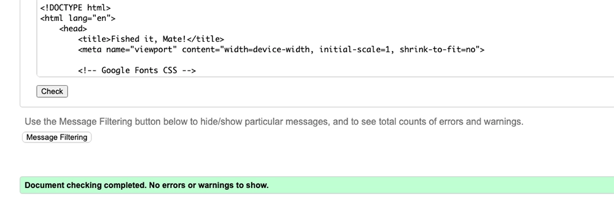 

All HTML pages were validated *see below*:

| HTML source Code/Page | Errors | Warnings |
| ---- | ----- | ------|
| Home | 0 | 0 | 0 | 
| Base | 0 | 0 | 0 | 
| Toast | 0 | 0 | 0 |
| blog_form | 0 | 0 | 0 |
| blog_post | 0 | 0 | 0 |
| blog_list | 0 | 0 | 0 |
| blog_edit | 0 | 0 | 0 |
| blog_delete | 0 | 0 | 0 |
| blog_search | 0 | 0 | 0 |
| profile_form | 0 | 0 | 0 |
| profile_detail | 0 | 0 | 0 |
| profile_confirm_delete | 0 | 0 | 0 |
| signin | 0 | 0 | 0 |
| signout | 0 | 0 | 0 |
| signup | 4 | 0 | 0 |

I had some messages 'from' pages such as my Register page - this seems to be due to the Django/All Auth forms behind the scenes, this happened on the last day and we discussed with my peer group about having the <p> in the Python and a fix for this is to set <div> however I don't have time now to sort it for these pages as I have tested my Python and don't want to have a knock on effect with this code.. However I cannot directly change the paragragh tags and spans in this section. Looking at the Python and sorting this will be a future feature.

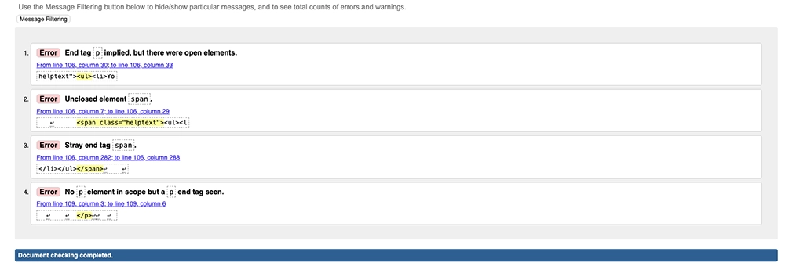

<hr>

### CSS Validation

CSS validation using jigsaw.w3 [W3C CSS Validator](https://jigsaw.w3.org/css-validator/) CSS validator with no errors:

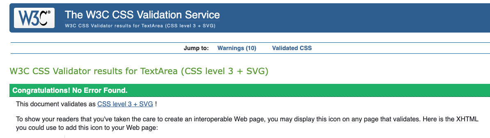

<p>
    <a href="http://jigsaw.w3.org/css-validator/check/referer">
        
    </a>
</p>

<p>
<a href="http://jigsaw.w3.org/css-validator/check/referer">
    
    </a>
</p>

External CSS for Bootstrap, provided by [CDN](https://cdn.jsdelivr.net/npm/bootstrap@5.0.1/dist/css/bootstrap.min.css) was not tested. 


<hr>

### JavaScript Validation

[JSHint](https://jshint.com/) was used to validate the 2 JavaScript files required for cooments and the terms and condition logi. 
Bootstrap purposes, obtained via [CDN](https://cdn.jsdelivr.net/npm/bootstrap@5.0.1/dist/css/bootstrap.min.css) was not validated through JSHint.

| Page | Screenshot | Errors | Warnings |
| ---- | ------ | ------ | ------ | 
| comment.js | 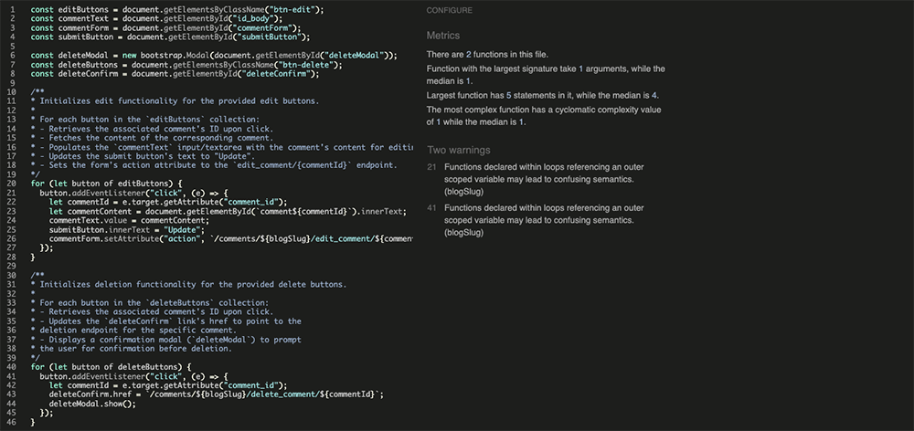 | none | 2 |
| terms.js | 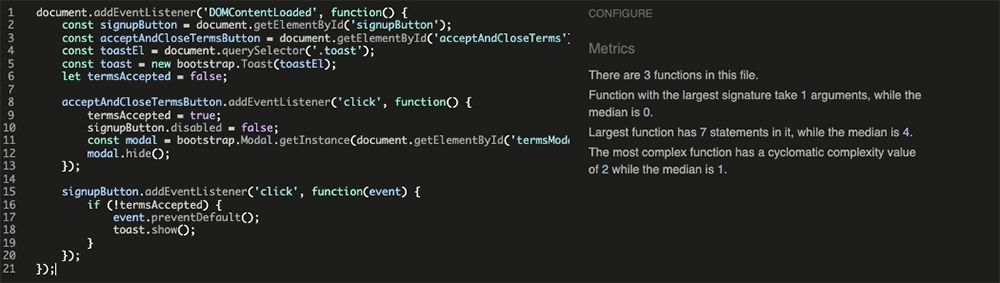 | none | none |


jshint - comment.js

Warnings addressed - for this project this would surfice but can be addressed in a later feature:

1. If blogSlug never changes, you can safely ignore the warning.
2. If you plan to maintain or scale the code, refactoring as shown above will make it cleaner and future-proof.


<hr>

### Python Validation

[CI Python Linter](https://pep8ci.herokuapp.com) -used for the validation of Python files in my project, due to having 3 apps this turned out to be a more complex process with a lot of moving parts, however no issues. Screenshots included below.

| Feature | admin.py | forms.py | models.py | urls.py | views.py | test.py | apps.py | signals.py |
| ---- | ---- | ------- | ------ | ----- | -----| ------ | ----- | -----|
| Main | n/a | n/a | n/a | [No Errors](documentation/testing/23_pl_main_urls.webp) | n/a | n/a  |  n/a  |  n/a  |
| Blog | [No Errors](documentation/testing/19_pl_blog_admin.webp) | [No Errors](documentation/testing/35_pl_blog_forms.webp) | [No Errors](documentation/testing/34_pl_blog_models.webp) | [No Errors](documentation/testing/32_pl_blog_urls.webp) | [No Errors](documentation/testing/31_pl_blog_views.webp) | [No Errors](documentation/testing/33_pl_blog_tests.webp) | [No Errors](documentation/testing/36_pl_blog_apps.webp) |  n/a  |
| Comments | [No Errors](documentation/testing/30_pl_comments_admin.webp) | [No Errors](documentation/testing/28_pl_comments_forms.webp) | [No Errors](documentation/testing/27_pl_comments_models.webp) | [No Errors](documentation/testing/25_pl_comments_urls.webp) | [No Errors](documentation/testing/24_pl_comments_views.webp) | [No Errors](documentation/testing/26_pl_comments_tests.webp) | [No Errors](documentation/testing/29_pl_comments_apps.webp) |  n/a  |
| Profile | [No Errors](documentation/testing/22_pl_profile_admin.webp) | [No Errors](documentation/testing/20_pl_profile_forms.webp) | [No Errors](documentation/testing/18_pl_profile_models.webp) | [No Errors](documentation/testing/15_pl_profile_urls.webp) | [No Errors](documentation/testing/14_pl_profile_views.webp) | [No Errors](documentation/testing/16_pl_profile_tests.webp) | [No Errors](documentation/testing/21_pl_profile_apps.webp) | [No Errors](documentation/testing/17_pl_profile_signals.webp) |


<hr> 

### Lighthouse Scores

Lighthouse tested on several different computers for effective research. This was done using chrome Incognito mode. As you can see there are some high scores for Accessibility and SEO [SEO is going to be a future feature though]. I am happy about these scores mixed in with other accessbility and compliance score this shows the attention to responsive, readers and keyboard actions.
The main issue was due to it being a blog: User images threw up the main errors and issues and as a future feature it would be good to look at ways to impliment an image convertor or image processor to deal with this on site automatically once a user uplaods. static images were uplaoded in the correct format and with webp or png.
The CDNs used for Bootstrap were also noted in the Lighthouse report as causing issue with performance.
<br> 
<br> 
Desktop Home Page

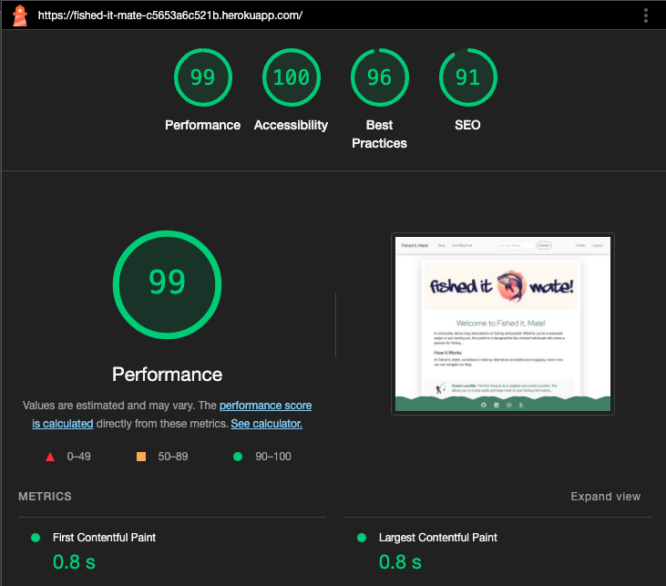

<br> 
<br> 
Desktop Blog Page

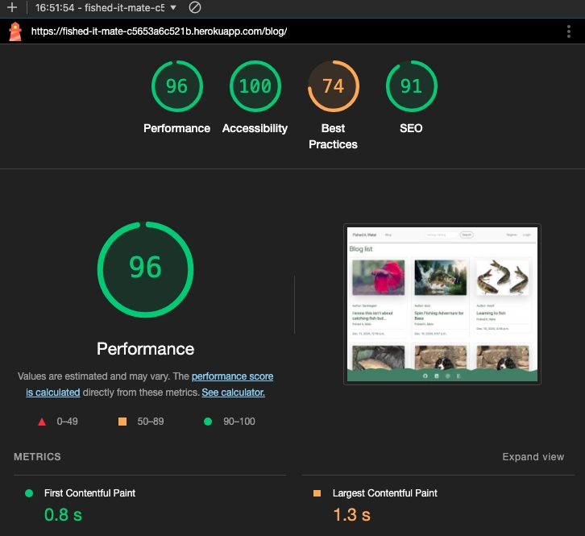

<br> 
<br> 
Desktop Post Page

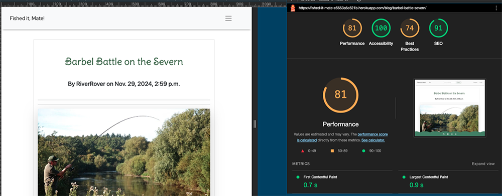

<br> 
<br> 
Best practice 

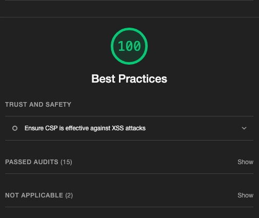

<br> 
<br> 
Mobile Home Page 


<br> 
<br>
Mobile Blog page 

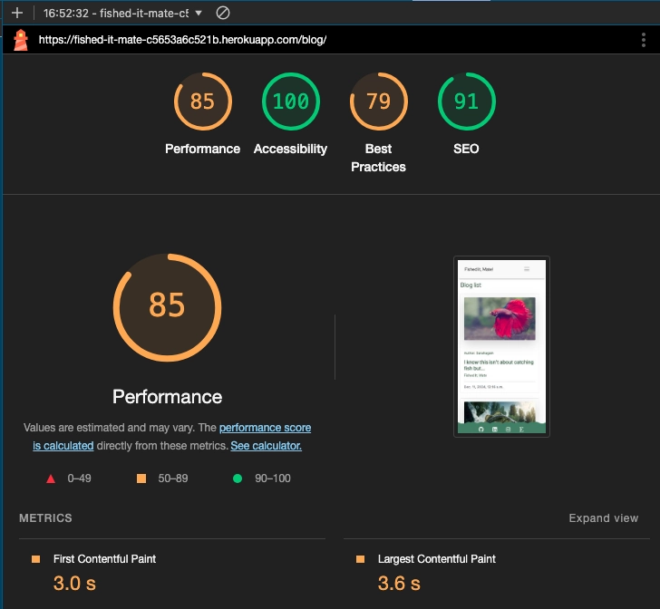

<br> 
<br> 
Mobile Post page


 
  
<hr>

### Wave Accisibility Evaluation 

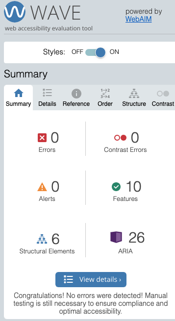

The WAVE report inspected various areas of the site. I cleaned up a few issues due to use of Heading tags, redundant links or not having labels, however the whole site is now inspected.

One thing to note was a 'redundant' link for the 'home' and the 'logo', I removed the home button from the navbar to just have the logo due to it's recommendation but feel it would be a good to have the 'home' for viewing the site and seeing a more obvious indication. 

| Feature | Errors | Contrast Errors | Alerts |
| ---- | ---- | ------- | ------ | 
| Home | 0 | 0 | 0 | 
| Base | 0 | 0 | 0 | 
| Toast | 0 | 0 | 0 |
| blog_form | 0 | 0 | 0 |
| blog_post | 0 | 0 | 0 |
| blog_list | 0 | 0 | 0 |
| blog_edit | 0 | 0 | 0 |
| blog_delete | 0 | 0 | 0 |
| blog_search | 0 | 0 | 0 |
| profile_form | 0 | 0 | 0 |
| profile_detail | 0 | 0 | 0 |
| profile_confirm_delete | 0 | 0 | 0 |
| signin | 0 | 0 | 0 |
| signout | 0 | 0 | 0 |
| signup | 0 | 0 | 0 |


### Accessible and Compliant checker

I also looked at the [Accessibility and Compliance checker](https://www.accessibilitychecker.org/), which is an accessible and compliant checker to make sure the site was inclusive and reached standards for inclusivity. Adding the url helps to find out the website is Accessible and Compliant, with ADA and WCAG compliance checking it identifies web accessibility issues and gives exact instructions for fixing them. No critical issues received:

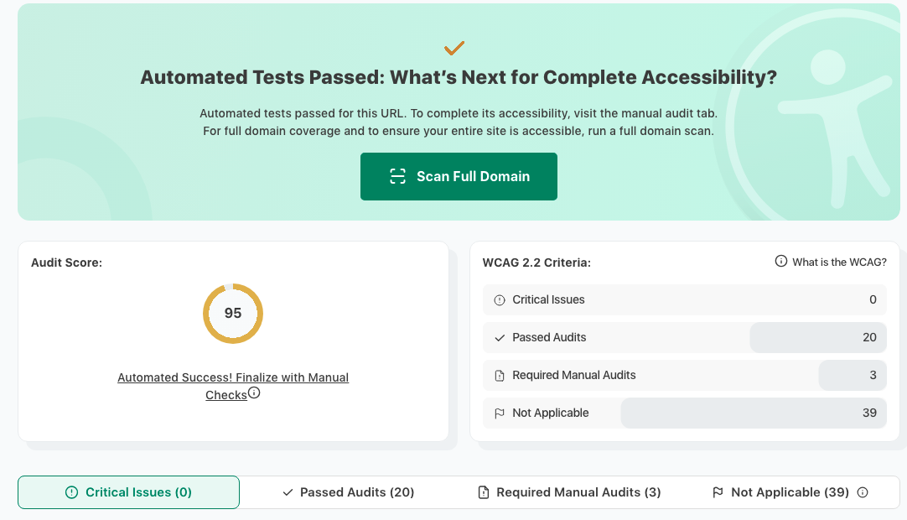
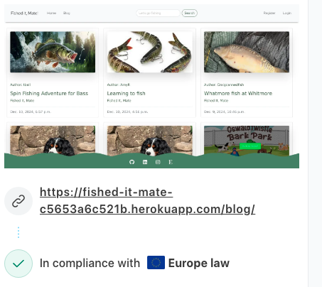

<hr>
<br>
<hr>


<p align="right"><a href="#contents">Back To Top</a></p>

## Manual Testing

### User Input/Form Validation

Testing was carried out on desktop using a Chrome browser to ensure all forms take the intended input and process the input appropriately.

| Feature | Tested? | User Input Required | User Feedback Provided | Pass/Fail | Fix |
| ------- | ------- | ------------------- | ---------------------- | --------- | --- |
| Navbar | Yes | Click | The user is directed to the specific page as intended | Pass | - |
| Register Page | Yes | Username/Password. Email is optional | Empty username and password fields prompt the user. too similar, password too short | Pass | - |
| Sign in | Yes | Username and Password | Username and Password must be exactly as originally registered. User notified once successfully signed in. [sign in](documentation/testing/40_feedback_profilesignin.webp) [sign in](documentation/testing/41_Feedback_profilesign.webp)  | Pass | - |
| Terms and conditions | Yes | Read terms and Conditions | User must read the Terms and Conditions provided to successfully register. [Terms and Conditions](documentation/testing/48_Feedback_terms1.webp) | Pass | - |
| Terms and conditions | Yes | Pop up after clicking read | User must accept the Terms and Conditions provided to successfully register. [Terms and Conditions](documentation/testing/50_Feedback_terms2.webp) | Pass | - |
| Search Field | Yes | Any input accepted but Search results are tailored to keyword | Users will be presented with the results of their search. If no results are found, the user receive feedback | Pass | - |
| Blog Post Links | Yes | Click | User is taken to the intended location | Pass | - |
| Add Post (Registered User) | Yes | Mixture of image and text fields | Only users who have registered and created a profile can now see the 'add blog post' link. Once clicked they are taken to a page to allow them to add a title, content, image, tpye of fish and fishing method [from a dropdown menu], once created they recieve a message [Create blog](documentation/testing/39_Feedback_blogcreate.webp)  | Pass | - |
| Comment Box (Registered User) | Yes | Text input accepted | User is thanked for their comment and awaiting approval [Comment approval](documentation/testing/51_Feedback_comment1.webp) | Pass | - |
| Edit Comment (Registered, Author) | Yes | Click button to choose Edit | Comment appears in comment box for update, and update button appears underneath. When pressed, the user is informed that the comment has been updated | Pass | - |
| Delete Comment (Registered, Author) | Yes | Click button to choose Delete comment | A feedback message pops up asking the user if they are sure they want to delete their comment | Pass | - |
| Edit Post (Registered, Author) | Yes | Image/Text fields | Changes made to post are saved and displayed. The user is informed that the post has been updated successfully | Pass | - |
| Delete Post (Registered, Author) | Yes | Click Confirm Delete button or Cancel | Post is deleted, and user is returned to the home page [blog delete](documentation/testing/44_Feedback_blogdelete.png)| Pass | - |
| Create Profile | Yes | Bio, content, Profile Image, fish and fishing method | User is notified that their profile has been successfully created and redirected to their profile page  | Pass | - |
| Profile Sign In | Yes | Username and Password | User is notified that they have signed into their profile successfully and redirected to their profile page | Pass | - |
| Profile Update | Yes | Updated profile fields Bio, content, Profile Image, fish and fishing method | User receives confirmation that their profile has been updated successfully | Pass | - |
| Profile Deletion | Yes | Click Confirm Delete button | User receives a confirmation message that their profile has been deleted, and they are redirected to the home page [Profile delete](documentation/testing/46_Feedback_profiledelete.webp) | Pass | - |
| Message System Notifications | Yes | Interaction triggering notifications (e.g., successful login, logout, post creation) | User receives appropriate feedback messages for actions (e.g., "Profile created successfully," "Post deleted successfully") | Pass | - |
| Log Out | Yes | Click Logout in the navigation menu | User is signed out, and a confirmation message appears at the top of the screen  | Pass | - |
| Footer Icons | Yes | Click | Icons take the user to the intended location via a new tab | Pass | - |

<hr>

### Testing Features for Fished It Mate

All features of the **Fished It Mate** website were tested across multiple devices and environments to ensure functionality met the expected outcomes. The following table outlines the features tested, their functionality, and results.

| Feature                          | Acceptance Criteria Met? | Tested | Response                                                                                         | Pass/Fail | Fix     |
|----------------------------------|---------------------------|--------|-------------------------------------------------------------------------------------------------|-----------|---------|
| View Home Page                   | Yes                       | Yes    | Home page loads correctly, displays the welcome message, and includes links to other sections   | Pass      | -       |
| User Registration                | Yes                       | Yes    | Users can register with a valid email and password. Error messages displayed for invalid input  | Pass      | -       |
| User Login                       | Yes                       | Yes    | Registered users can log in, and are redirected to the dashboard                                | Pass      | -       |
| User Logout                      | Yes                       | Yes    | Users can log out successfully and are redirected to the home page                              | Pass      | -       |
| View Fishing Spots               | Yes                       | Yes    | Fishing spots list is displayed with correct filters and sorting functionality                 | Pass      | -       |
| Add Fishing Spot (Logged In User)| Yes                       | Yes    | Logged-in users can add a new fishing spot with required details, including photos              | Pass      | -       |
| Edit Fishing Spot (Owner Only)   | Yes                       | Yes    | Owners can edit details of the fishing spots they added                                         | Pass      | -       |
| Delete Fishing Spot (Owner Only) | Yes                       | Yes    | Owners can delete the fishing spots they added                                                  | Pass      | -       |
| Leave a Review                   | Yes                       | Yes    | Logged-in users can leave a review on a fishing spot, with proper input validation              | Pass      | -       |
| View Reviews                     | Yes                       | Yes    | Users can view all reviews for a fishing spot                                                   | Pass      | -       |
| Like/Unlike a Fishing Spot       | Yes                       | Yes    | Users can like/unlike fishing spots, and the like count updates in real-time                   | Pass      | -       |
| Filter Fishing Spots             | Yes                       | Yes    | Filters (e.g., location, fish types) work as expected                                           | Pass      | -       |
| View User Profile                | Yes                       | Yes    | Users can view their profile and see their saved spots, reviews, and likes                     | Pass      | -       |
| Edit Profile Information         | Yes                       | Yes    | Users can update their profile details (e.g., username, profile picture)                       | Pass      | -       |
| Save Fishing Spots to Favorites  | Yes                       | Yes    | Users can save fishing spots to a favorites list                                                | Pass      | -       |
| Responsive Design                | Yes                       | Yes    | Website is responsive and displays correctly on desktop, tablet, and mobile devices            | Pass      | -       |
| Accessibility Features           | Yes                       | Yes    | All buttons, forms, and images have alt tags, labels, and are keyboard-navigable               | Pass      | -       |
| Error Pages                      | Yes                       | Yes    | 404 and 500 error pages are custom-designed and informative                                     | Pass      | -       |

<hr>

### Dev Tools/Real World Testing

Using Dev tools and real world testing using friends and colleagues for responsive issues. All tests were worked through over the course of the project and at the end passed all the devices and screen sizes looked at. Links worked, navigationa and creating the custom features of Profile and blog posts functioned effectively. All dev tools tests were conducted via Chrome and also Safari for consistency. 

Tested devices

|   Device   |  Features  |  Issues  |   fix  |
|------------|------------|----------|--------|
| iphone 13-15| All       | None   |   not needed |
| ipad Air  | All     | None   |  not needed |
| Macbook pro | All    |  None   |  not needed |
| iMac     |  All    |  None   |  not needed |
| Microsoft Surface | All   | None  |  not needed |


<hr>

### Browser Compatibility 

Happy Heath was tested on the following browsers. New users were created and old users data edited. All features were tested and no issues found:

- Chrome v131.0.6778.86
- Edge v131.0.2903.51
- Safari v18.1.1

<hr>


<p align="right"><a href="#contents">Back To Top</a></p>


## Errors and Bugs
<br>
<details>
<summary>Debug = True</summary>
<br>

An error which I need reminding about...`Debug=True`. This has got me a few times, especially with the styling aspects, and always after I git push notice I didn't set back to False.
<br>
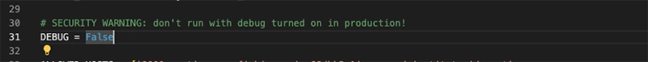
<br>

Not so much an error and more a precaution *or better workflow* decided to use a branch moving into the build stages to keep flow and then merge to main with changes that work.
Created a barnch : `git switch -c branchname`, then `git push --set-upstream origin martinapp` for the first push so REMOTE knows it exists.

Then for merging use: switch to the main - `git checkout main`, pull the changes from the REMOTE main branch - `git pull`. Switch back to the local `git checkout martinapp`, merge this local branch into the local new branch `git merge main`. Resolve any conflicts then *git add and commit* and finally push. Then being my own repo I need do the pull requests.

<br>
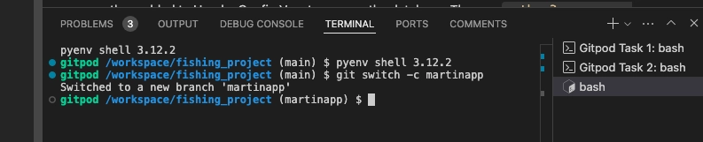
<br>
</details>
<br>
<details>
<summary>Server Error (500)</summary>
<br>

Part 1

Heroku threw up an early bug after I had made some changes to my views and changing the index.html to base.html. 
My first error was for `DISABLE_COLLECTSTATIC=1` and couldn't perform the Build:

Error: Unable to generate Django static files.
 !     
 !     The 'python manage.py collectstatic --noinput' Django
 !     management command to generate static files failed.
 !     
 !     See the traceback above for details.
 !     
 !     You may need to update application code to resolve this error.
 !     Or, you can disable collectstatic for this application:
 !     
 !        $ heroku config:set DISABLE_COLLECTSTATIC=1
 !     
 !     https://devcenter.heroku.com/articles/django-assets

This was after changing me DEBUG to DEBUG = ‘DEBUG’ in os.environ
However looking at the *view logs* there was another error for 'comments'. This was due to adding the comments register in admin...before I had setup the model for it:
```
from django.contrib import admin
from .models import Blog, Comment

# Register your models here.
admin.site.register(Blog)
admin.site.register(Comment)
```
I amended this code and pushed. And then recieved a Server error 500.

Part 2

My first concern was the DEBUG, however I realised I had renamed my template>index.html to base.html to keep consistent with the project, and not become confusing. However I had NOT changed this in the views.py so changed it for the TemplateView:

```
class HomePage(TemplateView): 
    """
    Displays home page"
    """
    template_name = 'base.html'
```

Now when I build again the build goes through and no errors!
</details>
<br>

<details>
<summary>Template issue - make sure to add </summary>
<br>

After changing the styling for the blog_list.html from a basic page to something more interesting Into to some errors:

<br>
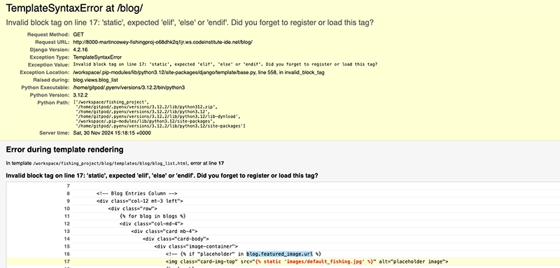
<br>

At first I thought this was an error with the if statement but turned out to be the  was missing
</details>
<br>

<details>
<summary>Template issue - semantic error</summary>
<br>

Again I encountered some consistent error messaging throughout and this highlights a common and persisntent friend - naming the files and then using the correct naming for the connections. Here I used 'post' instead of 'blog' and it threw the page completely out. A simple correction brought me back and had an amazing sense of accomplishment when the page poaded to the new format.

<br>
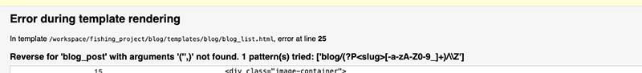
<br>
<br>
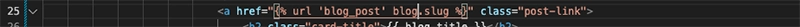
<br>

<br>
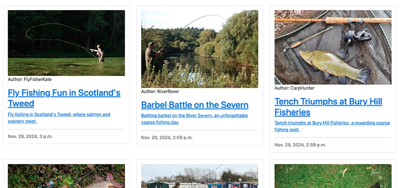
<br>

</details>
<br>

AllAuth error - lost </form> end tag which threw the whole site off when trying to linnk the login/logout/signup functionality. Base.html had a missing end tag for the form so it was acting like a GET request rather than a POST request.


Edit comments - mismatch error. Due to separating the apps the connetion need some javascript but the link didn't match and needed changing in the javascript code.


<hr>


<p align="right"><a href="#contents">Back To Top</a></p>

### Custom App errors and bugs

I came across a lot of errors during the custom element as I'm new to Django and to programming, I had a lot of discussion with perplexity ai and trying to make sure I was following procedures correctly for my models, views, and urls etc. However with a lot of moving parts I did lose track of myself a great deal. In the beginning I was rather blind in this process with the Code Institute walkthrough [previously] the only exposure to Django I had been through. I relied heavily on the coding coaches - John, Roo and Mark, but soon began to notice certai messages and usual patterns that occured *as listed below*. As I built confidence I was managing to use stack overfow and other sources to combine my previous learning with perplexity into more coherent paths to take. i realised ealry on that the real fun here was to solve errors. One of my first decisiond was to use a branchn in my workspace so it meant I had manageable tolerance on my exploration, however in retrospect what I now realise is there isn't a lot of commit history surounding these errors. Here are just a few of the more problematic challenges I had to overcome, amongst what felt like one big error solving session. Unfortunately this means there isn't a history of commit messages for 'Fix', which is something I will adhere to in the future.


| Error/Issue | Description | Area Affected | Attempted Solutions | Final Solution | commit |
|-------------|-------------|---------------|---------------------|----------------|--------|
| NoReverseMatch: 'profile_detail' | Error when trying to access user profile page using `user.profile.slug` | URL Configuration, Profile App | Checked URL patterns, view functions | Added `slug` field to Profile model and updated URL patterns to use `slug` instead of `pk` | [be89f9a](https://github.com/MartinCowey/fishing_project/commit/be89f9a5913c0e7a8c9372e4c976560a082e644f)           |
| IntegrityError: NOT NULL constraint failed | Occurred when saving a new blog post without an author | Blog App, Models | Tried setting default author in model | Modified view to automatically set the logged-in user as the author before saving |[be89f9a](https://github.com/MartinCowey/fishing_project/commit/be89f9a5913c0e7a8c9372e4c976560a082e644f)           |
| TemplateDoesNotExist | Django couldn't find the specified template for rendering | Template System | Checked template directories, naming | Corrected template location and ensured proper naming convention in views | na  |
| AttributeError: 'User' object has no attribute 'profile' | Error when trying to access user profile | User Authentication, Profile App | Checked if profile was created for all users | Implemented post_save signal to create a profile for each new user automatically | na           |
| Form validation errors | Custom form fields not validating correctly | Forms, Blog App | Adjusted form field definitions | Implemented clean methods in form class to add custom validation logic | [e755f8d](https://github.com/MartinCowey/fishing_project/commit/e755f8d30728fb9b8a8ca7a0c0de62e214c43a76)           |
| Static files not loading | CSS and JavaScript files not being served in production | Static File Handling | Checked STATIC_URL and STATIC_ROOT settings | Ran `collectstatic`, configured web server to serve static files correctly | [fd2d17b](https://github.com/MartinCowey/fishing_project/commit/fd2d17b6953efbe20a251bd96cca3c68644aa229)     |


### Errors Encountered and Resolutions

| Error/Issue              | Description                                                                                          | Area Affected          | Attempted solutions                                                                                                    | Final Solution                                                                                                      |
|--------------------------|------------------------------------------------------------------------------------------------------|------------------------|-----------------------------------------------------------------------------------------------------------------|---------------------------------------------------------------------------------------------------------------|
| URL Pattern Conflict     | Search URL was mistakenly matching another URL due to the order of URL patterns in `urls.py`.       | Blog Search and Posts  | Rearranged URL patterns to test which was conflicting. Added `debug=True` for detailed error output.          | Re-ordered the `urls.py` patterns, ensuring more specific paths were listed before more generic ones.        |
| Profile Model Issue      | The `Profile` model was not saving properly, resulting in `null` values for some fields.            | Profile App            | Verified model fields, tried default values, and re-ran migrations.                                           | Fixed the issue by adding `blank=True` and `null=True` to optional fields in the model, then re-migrating.   |
| Blog Author Assignment   | Blog posts were not associating with the logged-in user correctly.                                   | Blog Post Creation     | Checked `views.py`, debugged user context in the request, and tested form submission with dummy data.         | Updated the `Blog` model and `views.py` to explicitly assign the logged-in user to the `author` field.       |
| TemplateDoesNotExist     | Received a "TemplateDoesNotExist" error for `base.html` when extending templates.                    | Template Rendering     | Verified the templates directory structure and `settings.py` template directory.                              | Corrected the directory path in `TEMPLATES['DIRS']` and ensured files were in the correct subdirectory.      |
| ForeignKey Integrity     | Deleting a user caused associated blog posts to throw integrity errors due to missing relationships. | Blog and Profile Models | Tried adding `on_delete=models.CASCADE` and tested alternate deletion policies.                                | Added `on_delete=models.SET_NULL` for the `author` field in the blog model to handle cases of deleted users. |
| Form Validation Error    | Blog creation form was failing to validate image uploads and required fields.                       | Blog Post Creation     | Debugged form submission process and reviewed `forms.py`.                                                    | Added custom validation logic to check for uploaded image file formats and updated required field handling.  |
| CSRF Token Missing       | "CSRF token missing or incorrect" error when submitting a blog post.                                | Blog Post Creation     | Verified the presence of `` in templates, checked middleware, and re-tested forms.           | Ensured `` was included in the form and middleware was enabled in `settings.py`.            |
| Profile View Error       | Error when fetching profiles for users without complete data.                                       | Profile App            | Debugged the `get_object_or_404` call and ensured proper data handling in the `views.py`.                     | Added error handling for missing data and default fallbacks in the `Profile` model.                         |
| Pagination Bug           | Pagination in blog posts was breaking for pages with no content.                                   | Blog Post Listing      | Tested different pagination sizes and debugged `paginator.page()`.                                            | Added a fallback view to handle empty pages gracefully using `EmptyPage` exception handling.                |

<hr>


<p align="right"><a href="#contents">Back To Top</a></p>